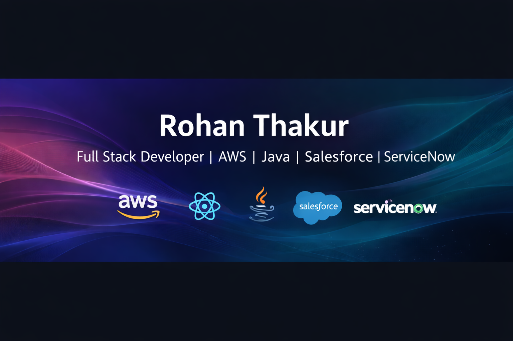

<h1 align="center">Hi 👋, I'm Rohan Thakur</h1>
<h3 align="center">Full Stack Developer | JAVA | AWS | Salesforce | ServiceNow</h3>

Building scalable backend systems & real-world products.

---

## 🙋 About Me

🎓 Computer Science Undergraduate  
💻 Full Stack Developer (Backend Focus)  
🧠 Scalable systems. Clean code. Real-world impact.

- ⚙️ MERN | Spring Boot | Salesforce | ServiceNow  
- 🔐 REST APIs • JWT • Secure hashing  
- ☁️ AWS & deployments  
- 🧩 DSA • OOPS • DBMS • System Design  
- 🚀 FinTech | SaaS | CRM | Distributed systems

---

## 🧠 Technical Skills

### 👨‍💻 Programming Languages

### 🎨 Frontend

### ⚙️ Backend & APIs

### 🗄️ Databases

### ☁️ Cloud / Platforms

### 🛠️ Tools

---

## 📚 Currently Learning

- Advanced System Design  
- Salesforce Administration & Automation  
- Cloud architecture & scalable deployments

---

## 🚀 Featured Projects

### 🔹 Crypto Trading Platform
Real-time cryptocurrency trading simulation with authentication, live price updates and portfolio tracking.  
**Tech:** Node.js, Express, MongoDB, WebSockets  
🔗 [https://github.com/Rohanthakur05/crypto-project](https://github.com/Rohanthakur05/ChainXchange.git)

---

### 🔹 Women Safety IoT Device
Smart wearable system providing GPS tracking, emergency alerts and mobile notifications.  
**Tech:** ESP8266, GPS, Blynk  

## 🤝 Connect With Me

  

  

